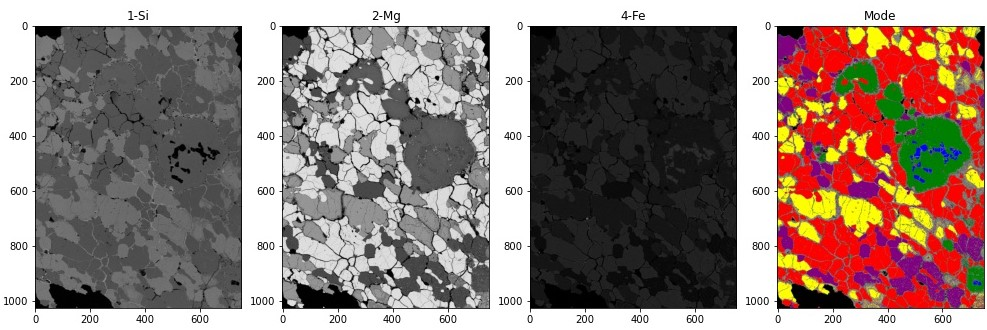
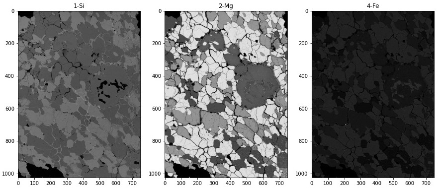
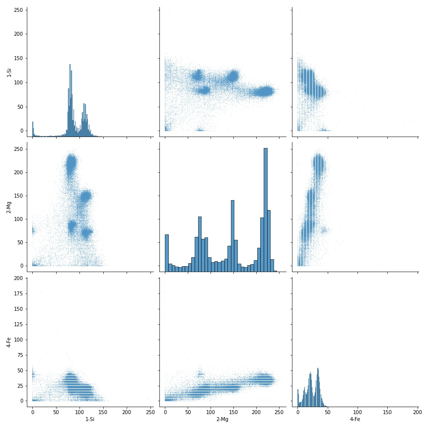
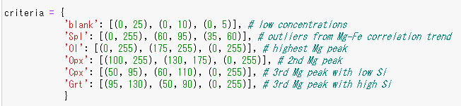
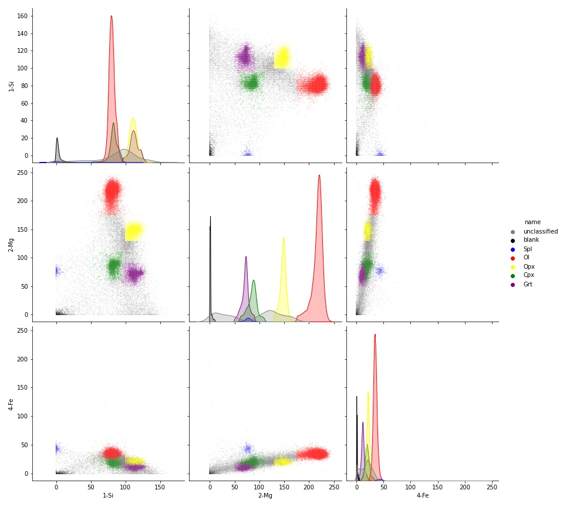
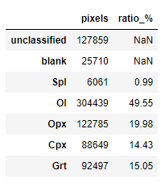

# GeochemModeAnalysis
<!--  -->

   

developped by [K. Mimura](https://github.com/KazuhideMimura) and N. Akizawa.

<!-- 
## Citation
AAA
-->

## Background
AAA

## Preparation

### If you are new to Python
1. Download all the files
2. Create a new folder in `/data` folder (any folder name)
3. place **grayscaled** mapping images for multiple elements in a folder created at the previous step (any file names)
4. Upload them to your google drive
5. Open and run `modeAnalysis.ipynb` by [Google Colaboratory](https://colab.research.google.com/)

### for those who are familiar with github and Python
You can also use `git clone` and run `modeAnalysis.ipynb` on your local PC

## Flow
### 1. load elemental composition maps and get brightness for each pixel

   

 

### 2. Find clusters from histograms and scatter diagrams

   

**Tips:** Dots are plotted semi-transparently so that clusters can easily be found.

 

### 3. determine threshold for each mineral

   

### 4. Check whether minerals are correctly labeled

   

   

 

### 5. calculate areas for each mineral by counting pixels

   

## Log
2023.4.21 Opened ver.1

2023.4.7 Created repository (ver. 0)