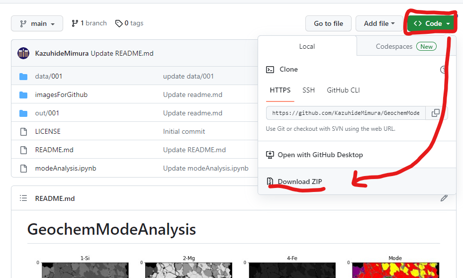

# GeoMAC (Geochemical Mode Analysis Calculator)
<!--  -->

developed by [K. Mimura](https://github.com/KazuhideMimura) and [N. Akizawa](https://sites.google.com/site/akizawanoriwebsite/home).

   

## Citation of this program
Mimura, K., & Akizawa, N. (2025). GeoMAC: Geochemical Mode Analysis Calculator (v1.1). Zenodo. https://doi.org/10.5281/zenodo.14676066

## Background
Modal composition of rock thin section has been conventionally estimated by point-counting method, using mechanical/electromechanical devices attached to a microscope. However, the point-counting method consumes significant time and needs special skill to identify minerals under the microscope. Even worse, the number of the point-counting device suppliers is getting decreased and some of the devices are no more supported from their original suppliers. Here, we developed a computational modal estimation method from elemental distribution maps of rock thin section. This method can deal with the constituent mineral phases as well as their grain boundaries. This method can be also applied for the rocks if elemental intensities with their coordinates are included in the elemental distribution maps.

## Preparation

### If you are new to Python
**tutorial:**
 
1. Download all the files and unpack them

   

2. Upload them to your google drive
3. Open and run `modeAnalysis.ipynb` by [Google Colaboratory](https://colab.research.google.com/)

**run with original data:**

4. Create a new folder in `/data` directory of the base folder uploaded on google drive (any folder name)
5. upload **grayscaled** mapping images for multiple elements in a folder created at the previous step (any file names)

### for those who are familiar with github and Python
You can also use `git clone` and run `modeAnalysis.ipynb` on your local PC

## Flow
### 1. load elemental composition maps and get brightness for each pixel

   

 

### 2. Find clusters from histograms and scatter diagrams

   

**Tips:** Dots are plotted semi-transparently so that clusters can easily be found.

 

### 3. determine threshold for each mineral

   

### 4. Check whether minerals are correctly labeled

   

   

 

### 5. calculate areas for each mineral by counting pixels

   

## Log
2025.1.17 Added DOI using zenodo.

2023.4.29 Version 1.1: loading csv data is supported

2023.4.21 Opened version 1

2023.4.7 Created repository (version 0)
